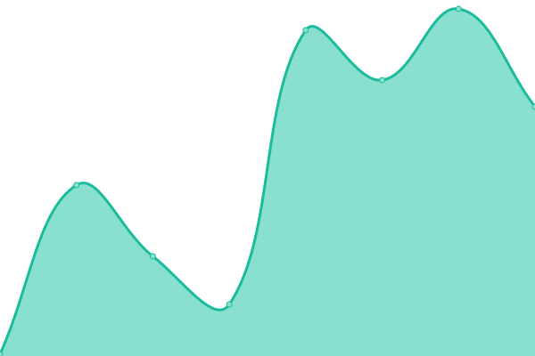

# [📈 Live Status](https://status.blahaj.systems): <!--live status--> **🟧 Partial outage**

This repository contains the open-source uptime monitor and status page for [blahaj.systems](https://blahaj.systems), powered by [Upptime](https://github.com/upptime/upptime).

With [Upptime](https://upptime.js.org), you can get your own unlimited and free uptime monitor and status page, powered entirely by a GitHub repository. We use [Issues](https://github.com/blahajsystems/status/issues) as incident reports, [Actions](https://github.com/blahajsystems/status/actions) as uptime monitors, and [Pages](https://status.blahaj.systems) for the status page.

<!--start: status pages-->
<!-- This summary is generated by Upptime (https://github.com/upptime/upptime) -->
<!-- Do not edit this manually, your changes will be overwritten -->
<!-- prettier-ignore -->
| URL | Status | History | Response Time | Uptime |
| --- | ------ | ------- | ------------- | ------ |
|  [Main Site](https://blahaj.systems) | 🟥 Down | [main-site.yml](https://github.com/BlahajSystems/status/commits/HEAD/history/main-site.yml) | 

 592ms
     
 | 

<a href="https://status.blahaj.systems/history/main-site">0.00%</a>
    

|  [Auth](https://auth.blahaj.systems) | 🟩 Up | [auth.yml](https://github.com/BlahajSystems/status/commits/HEAD/history/auth.yml) | 

 824ms
     
 | 

<a href="https://status.blahaj.systems/history/auth">100.00%</a>
    

|  [Portainer](https://portainer.blahaj.systems) | 🟩 Up | [portainer.yml](https://github.com/BlahajSystems/status/commits/HEAD/history/portainer.yml) | 

 864ms
     
 | 

<a href="https://status.blahaj.systems/history/portainer">100.00%</a>
    

|  [JetBrains Space](https://portainer.blahaj.systems) | 🟩 Up | [jet-brains-space.yml](https://github.com/BlahajSystems/status/commits/HEAD/history/jet-brains-space.yml) | 

 187ms
     
 | 

<a href="https://status.blahaj.systems/history/jet-brains-space">100.00%</a>
    

|  [TeamCity](https://ci.blahaj.systems) | 🟥 Down | [team-city.yml](https://github.com/BlahajSystems/status/commits/HEAD/history/team-city.yml) | 

 522ms
     
 | 

<a href="https://status.blahaj.systems/history/team-city">0.00%</a>
    

|  [Jellyfin](https://jellyfin.blahaj.systems) | 🟩 Up | [jellyfin.yml](https://github.com/BlahajSystems/status/commits/HEAD/history/jellyfin.yml) | 

 576ms
     
 | 

<a href="https://status.blahaj.systems/history/jellyfin">100.00%</a>
    

<!--end: status pages-->

[**Visit our status website →**](https://status.blahaj.systems)

## 📄 License

- Powered by: [Upptime](https://github.com/upptime/upptime)
- Code: [MIT](./LICENSE) © [blahaj.systems](https://blahaj.systems)
- Data in the `./history` directory: [Open Database License](https://opendatacommons.org/licenses/odbl/1-0/)
